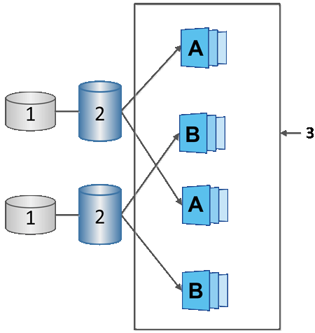

= Snapshot排程和Snapshot一致性群組
:allow-uri-read: 
:icons: font
:imagesdir: ../media/

[role="lead"]
使用快照映像集合排程、並使用快照一致性群組來管理多個基礎磁碟區。

若要輕鬆管理基礎磁碟區的快照作業、您可以使用下列功能：

* * Snapshot schedule *-自動化單一基礎Volume的快照。
* * Snapshot一致性群組*-將多個基礎磁碟區管理為單一實體。

== Snapshot排程

如果您想要自動為基礎磁碟區擷取快照、可以建立排程。例如、您可以定義排程、以便在每週六午夜、每月第一天或您決定的任何日期和時間拍攝快照影像。在單一排程達到最多32個快照之後、您可以暫停排程的快照、建立更多保留容量、或是刪除快照。您可以手動刪除快照、或是將刪除程序自動化。刪除快照映像之後、就可以再使用其他保留容量。

== Snapshot一致性群組

您可以建立快照一致性群組、以確保快照映像同時在多個磁碟區上擷取。Snapshot映像動作會在整個Snapshot一致性群組上執行。例如、您可以使用相同的時間戳記來排程所有磁碟區的同步快照。Snapshot一致性群組非常適合橫跨多個磁碟區的應用程式、例如將記錄儲存在一個磁碟區上的資料庫應用程式、以及儲存在另一個磁碟區上的資料庫檔案。

快照一致性群組中包含的磁碟區稱為成員磁碟區。當您將磁碟區新增至一致性群組時、System Manager會自動建立與該成員磁碟區對應的新保留容量。您可以定義排程來自動建立每個成員磁碟區的快照映像。

^1^保留容量；^2^成員磁碟區；^3^一致性群組快照映像
